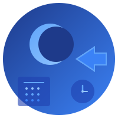

# NoxShift - Smart Workforce Management

<div align="center">
  
  <h3>Modern Employee Shift Scheduling & Workforce Management</h3>
  <p>A feature-rich scheduling application built with React, TypeScript, Firebase, and Tailwind CSS</p>
</div>

---

## ✨ Features

### 📅 **Smart Scheduling**
- **Visual Calendar Interface** - Intuitive month-view calendar with color-coded shifts
- **Quick Shift Creation** - Click any day to add shifts with customizable times and roles
- **Drag-and-Drop** - Easy shift management with visual feedback
- **Shift Presets** - Configurable templates (Full Day, Morning, Evening) for faster scheduling
- **Department Filtering** - View and manage schedules by department
- **Copy/Paste Days** - Duplicate entire day schedules with one click
- **Draft Mode** - Create draft shifts before publishing to the team

### 👥 **Employee Management**
- **Employee Database** - Track employee details with customizable hourly rates
- **Custom Color Coding** - Assign unique colors to employees for easy visual identification
- **Time Off Tracking** - Mark employee unavailability and time off requests
- **Conflict Detection** - Automatic warnings for double-booked employees

### 🎨 **Customization**
- **Theme Selector** - Choose from 6 color themes (Blue, Indigo, Purple, Emerald, Rose, Slate)
- **Font Options** - Switch between Sans, Serif, and Mono font families
- **Custom Roles** - Define your own position types (Reception, Concierge, Manager, etc.)
- **Custom Departments** - Organize schedules by departments or locations
- **Shift Presets** - Create and save your most-used shift time templates

### 📊 **Analytics & Insights**
- **Monthly Statistics** - View total shifts, unique employees, and hours worked
- **Cost Tracking** - Automatic labor cost calculations based on employee rates
- **Per-Employee Reports** - See individual hours and costs per employee
- **Coverage Analytics** - Identify scheduling gaps and coverage issues

### 🔄 **Workflow Features**
- **Draft/Publish System** - Review and approve schedules before making them live
- **Bulk Publishing** - Publish all draft shifts with one click
- **CSV Export** - Export schedules with detailed cost breakdowns
- **Print Optimization** - Clean, professional print layouts for physical schedules

### ☁️ **Data & Collaboration**
- **Firebase Integration** - Real-time data synchronization across devices
- **Public/Private Storage** - Choose between shared or personal schedules
- **Auto-Save** - Changes sync automatically without manual saves
- **Persistent Storage** - All data stored securely in the cloud

### 🤖 **AI Assistant** (Coming Soon)
- **Schedule Analysis** - AI-powered insights into scheduling patterns
- **Email Drafting** - Generate schedule announcement emails
- **Smart Suggestions** - Intelligent recommendations for optimal coverage

### 📱 **User Experience**
- **Responsive Design** - Works seamlessly on desktop, tablet, and mobile
- **Modern UI** - Beautiful interface built with Tailwind CSS
- **Lucide Icons** - Clean, professional iconography throughout
- **Keyboard Shortcuts** - Efficient navigation for power users
- **Status Indicators** - Real-time connection and sync status

## 🚀 Getting Started

### Prerequisites

Before running this project, make sure you have:

- **Node.js** (v18 or higher) - [Download here](https://nodejs.org/)
- **npm** or **yarn** package manager
- **Firebase Account** (for data persistence) - [Get started](https://firebase.google.com/)

### Installation

1. **Clone the repository:**
```bash
git clone https://github.com/cmc-creator/NoxShift.git
cd NoxShift
```

2. **Install dependencies:**
```bash
npm install
```

3. **Configure Firebase:**

Create a `src/firebase.config.ts` file with your Firebase credentials:
```typescript
export const firebaseConfig = {
  apiKey: "your-api-key",
  authDomain: "your-project.firebaseapp.com",
  projectId: "your-project-id",
  storageBucket: "your-project.appspot.com",
  messagingSenderId: "your-sender-id",
  appId: "your-app-id"
};

export const appId = "your-unique-app-id";
export const initialAuthToken = null; // Optional custom auth token
```

4. **Set up Firestore Database:**

In your Firebase console:
- Enable Firestore Database
- Set up security rules (see Security Rules section below)
- Enable Anonymous Authentication (or your preferred auth method)

## 🏃 Running the Application

### Development Mode

**Frontend (Vite dev server):**
```bash
npm run dev
```
This starts the React app at **http://localhost:3000**

The application will open with an empty schedule. Click the "Apply Finalized Jan 2026 Schedule" button to populate demo data.

### Production Build

```bash
npm run build
npm run preview
```

The build output will be in the `dist/` directory.

## 📁 Project Structure

```
NoxShift/
├── public/                 # Static assets
│   └── noxshift-logo.svg  # Application logo
├── src/                    # Frontend React application
│   ├── components/         # React components
│   │   ├── Scheduler.tsx  # Main scheduling component
│   │   └── Sidebar.tsx    # Navigation sidebar (unused)
│   ├── pages/             # Page components (for future routing)
│   ├── App.tsx            # Root component
│   ├── main.tsx           # Application entry point
│   ├── index.css          # Global styles and Tailwind imports
│   ├── firebase.config.ts # Firebase configuration
│   └── vite-env.d.ts      # TypeScript declarations
├── server/                # Backend API (optional, for future features)
│   └── index.js           # Express server
├── prisma/                # Database schema (for future features)
│   └── schema.prisma      # Prisma schema definition
├── index.html             # HTML entry point
├── package.json           # Dependencies and scripts
├── vite.config.ts         # Vite build configuration
├── tailwind.config.js     # Tailwind CSS configuration
├── tsconfig.json          # TypeScript configuration
└── README.md              # This file
```

## 🛠️ Tech Stack

### Frontend
- **React 18** - Modern UI library with hooks
- **TypeScript** - Type-safe JavaScript
- **Vite** - Lightning-fast build tool and dev server
- **Tailwind CSS** - Utility-first CSS framework
- **Lucide React** - Beautiful icon library
- **date-fns** - Modern date utility library

### Backend & Data
- **Firebase** - Real-time database and authentication
- **Firestore** - NoSQL cloud database
- **Firebase Auth** - User authentication (anonymous/custom)
- **Node.js** - Runtime environment (for optional API server)
- **Express** - Web framework (for future API features)
- **Prisma** - Database ORM (for future SQL features)

## 🔐 Security & Firebase Rules

### Recommended Firestore Security Rules

```javascript
rules_version = '2';
service cloud.firestore {
  match /databases/{database}/documents {
    // Public data access
    match /artifacts/{appId}/public/{document=**} {
      allow read, write: if request.auth != null;
    }
    
    // Private user data
    match /artifacts/{appId}/users/{userId}/{document=**} {
      allow read, write: if request.auth != null && request.auth.uid == userId;
    }
  }
}
```

## 🎯 Key Features Explained

### Draft/Publish Workflow
1. Create shifts in "draft" mode (default)
2. Review all draft shifts (shown with dashed borders)
3. Click "Publish" to make all drafts visible to the team
4. Published shifts appear solid and are considered final

### Copy/Paste Days
1. Hover over any day with shifts
2. Click the copy icon to copy all shifts for that day
3. Navigate to another day and click paste
4. All shifts are duplicated with the new date in draft mode

### Department Management
1. Open Settings → Departments tab
2. Add new departments (e.g., "Front Desk", "Kitchen", "Maintenance")
3. Use the department filter in the header to view specific departments
4. Assign shifts to departments when creating/editing

### Cost Tracking
1. Set hourly rates for each employee in Settings
2. View monthly stats to see total labor costs
3. Export CSV for detailed per-shift cost breakdowns
4. Monitor budget vs actual spending

## 🎨 Customization Guide

### Adding Custom Themes

Edit `APP_THEMES` in `src/components/Scheduler.tsx`:

```typescript
const APP_THEMES = {
  yourTheme: { 
    primary: 'bg-yourcolor-600', 
    hover: 'hover:bg-yourcolor-700', 
    text: 'text-yourcolor-600',
    border: 'border-yourcolor-600',
    ring: 'ring-yourcolor-200',
    bgSoft: 'bg-yourcolor-50'
  }
};
```

### Custom Shift Presets

In Settings → Shift Presets:
- Click "Add Preset"
- Name it (e.g., "Night Shift")
- Set start time (e.g., "22:00")
- Set end time (e.g., "06:00")
- Save and use in shift creation

## 📸 Screenshots

[Demo screenshots coming soon]

## 🤝 Contributing

This is an actively developed project. Contributions, issues, and feature requests are welcome!

## 📝 License

MIT License - feel free to use this project for personal or commercial purposes.

## 🙏 Acknowledgments

- Built with modern web technologies
- Inspired by real workforce management needs
- Designed for small to medium-sized teams

---

<div align="center">
  <p>Made with ❤️ for better workforce management</p>
  <p><strong>NoxShift</strong> - Schedule smarter, not harder</p>
</div>
